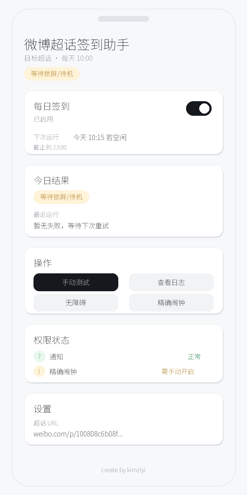
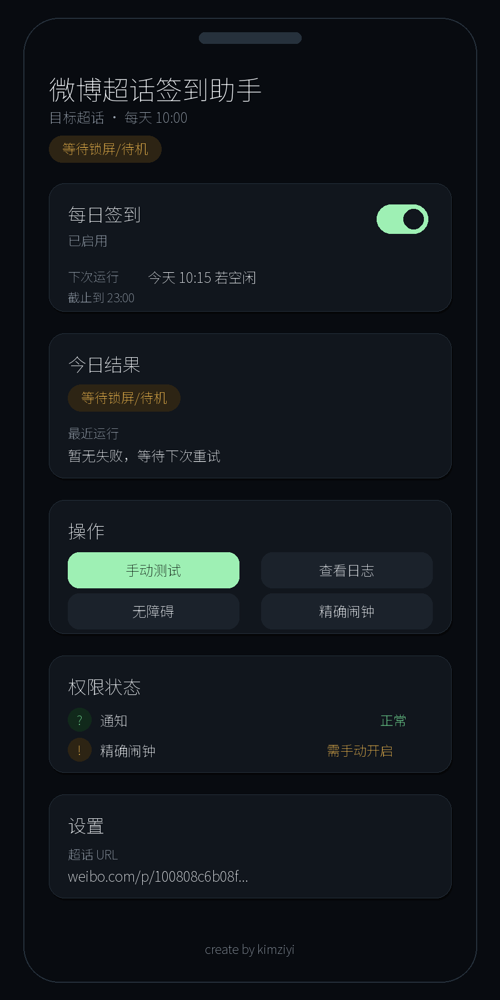

# 微博超话签到助手 Android APK

这是一个自用 Debug APK 工程，用于备用安卓机按用户选择的每日尝试时间打开微博 App，进入配置好的超话并通过无障碍服务识别/点击签到。

它会优先避免打扰正在使用的手机；如果系统拦截后台打开微博，或设备处于安全锁屏状态，App 会记录原因并通过本机通知提示你点按继续。

它不保存微博密码，不处理验证码，不做批量账号；检测到登录失效、验证码、安全验证、账号异常或访问受限时会停止并发本机通知。

## 运行界面

| 白天模式 | 夜间模式 |
| --- | --- |
|  |  |

## 功能

- 目标超话可在 App 内配置
- 每日尝试时间可选择，默认 `10:00`
- 手动测试签到
- 每日闹钟调度
- 开机、时间变化、时区变化后恢复调度
- 手机正在使用时延后重试，安全锁屏、系统拦截或省电限制时给出明确提示
- 45 秒内未识别到微博页面时自动超时并提示
- 无障碍服务只监听 `com.sina.weibo`
- 当前设备状态、下次重试时间、截止时间
- 最近日志
- 本机通知

## 手机准备

1. 安装微博 App，并在微博 App 内登录。
2. 手机保持插电、联网、开机。
3. 备用机建议使用无密码或滑动解锁。如果是安全锁屏，App 不承诺静默完成，会通知你解锁后继续。
4. 安装本 APK 后开启：
   - 通知权限
   - 无障碍权限：`微博超话签到助手`
   - 精确闹钟权限，Android 12+ 可能需要手动开启
   - 省电限制：允许本应用忽略电池优化；部分手机还需要在系统管家里允许后台运行/自启动
5. 打开 App，确认每日签到开关已开启，并选择每日尝试时间。

## 锁屏/待机规则

- 手机亮屏且未锁屏：认为你正在使用，暂不跳转微博，每 15 分钟重试一次。
- 手机息屏或非安全锁屏：允许自动打开微博执行签到。
- 安全锁屏：停止自动打开微博，发通知提醒解锁后继续。
- 到当天 23:00 仍不能执行：停止当日重试，并在通知和日志里写明真实原因。
- 如果微博或系统省电策略拦截后台启动，45 秒 watchdog 会结束本次尝试并通知你处理。

## 已构建 APK

可以在 Release 页面下载：

[GitHub Release 页面](https://github.com/1clipse/weibo-chaohua-android/releases/tag/v1.1.2)

仓库内也包含当前 Debug APK：

```text
releases\weibo-chaohua-checkin-debug.apk
```

当前 Debug APK 已输出到：

```text
D:\codex-outputs\weibo-chaohua-android\apk\weibo-chaohua-checkin-debug.apk
```

如果电脑已安装 ADB，可用 USB 调试安装：

```powershell
D:\codex-deps\weibo-chaohua-android\android-sdk\platform-tools\adb.exe install -r D:\codex-outputs\weibo-chaohua-android\apk\weibo-chaohua-checkin-debug.apk
```

## 构建

推荐构建命令。该脚本会固定使用 D 盘依赖目录，并把 APK 复制到 D 盘：

```powershell
.\build-debug-apk.ps1
```

默认目录：

```text
D:\codex-deps\weibo-chaohua-android
D:\codex-outputs\weibo-chaohua-android\apk\weibo-chaohua-checkin-debug.apk
```

说明：脚本会把 JDK、Gradle 缓存、Android SDK 和最终交付 APK 放在 D 盘。Gradle 的临时中间产物仍会出现在当前项目目录的 `app\build` 下。

标准 Gradle 构建命令：

```powershell
.\gradlew.bat assembleDebug
```

APK 输出路径：

```text
app\build\outputs\apk\debug\app-debug.apk
```

如果本机没有 Android SDK，请安装 Android Studio 或 Android command-line tools，并安装至少：

```powershell
sdkmanager "platforms;android-35" "build-tools;35.0.0" "platform-tools"
```

## 真机测试

1. 安装 APK。
2. 授权通知、无障碍、精确闹钟。
3. 打开“省电限制”设置，允许忽略电池优化；必要时在系统管家里允许后台运行。
4. 点“每日尝试时间”，确认滚轮式时间选择器能保存新时间。
5. 点“手动测试签到”。
6. 确认微博打开到目标超话。
7. 已签到时应发成功通知；未签到时应点击签到后发成功通知。
8. 锁屏、安全锁屏、正在使用手机时分别测试一次，确认状态、日志和通知能说明原因。
9. 退出微博登录后再次测试，应发失败通知并记录日志。

## 注意

这个 APK 依赖微博 App 的可见文字和按钮结构。如果微博 UI 改版，需要更新 `CheckinTextClassifier.kt` 或 `WeiboAccessibilityService.kt` 的识别/点击规则。
